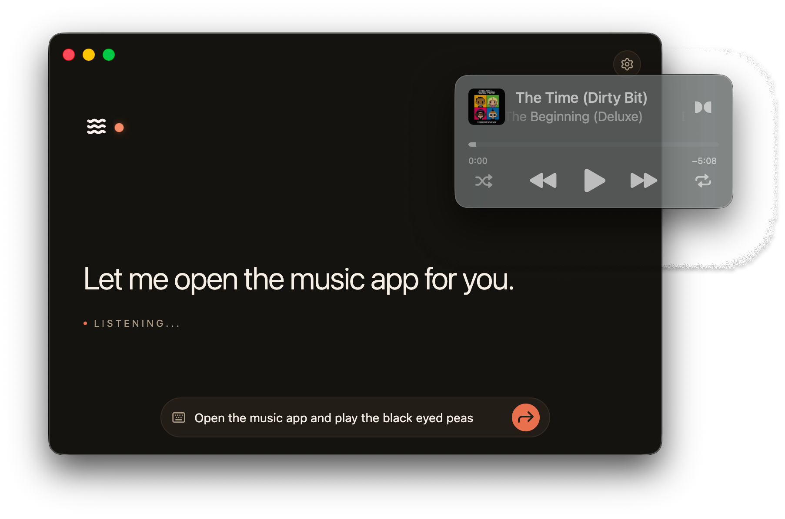

<div align="center">

<a href="https://getopendex.com/"></a>

# OpenDex

**A voice-first, open-source AI assistant for your desktop.**
Wake it, talk to it, and a tool-using agent talks back — in a cinematic interface you choose.

[](LICENSE)
[](#install)
[](https://www.electronjs.org/)
[](https://sdk.vercel.ai/)
[](https://github.com/wassgha/notjarvis/stargazers)
[](https://github.com/wassgha/opendex/releases/latest)

<a href="https://getopendex.com/"></a>

</div>

## Download

<div align="center">

<a href="https://github.com/wassgha/opendex/releases/latest/download/OpenDex-mac-arm64.dmg"></a> &nbsp; <a href="https://github.com/wassgha/opendex/releases/latest/download/OpenDex-mac-x64.dmg"></a> &nbsp; <a href="https://github.com/wassgha/opendex/releases/latest/download/OpenDex-Setup.exe"></a> &nbsp; <a href="https://github.com/wassgha/opendex/releases/latest/download/OpenDex-linux.deb"></a> &nbsp; <a href="https://github.com/wassgha/opendex/releases/latest/download/OpenDex-linux.AppImage"></a>
</div>

Or browse every version on the [Releases](https://github.com/wassgha/opendex/releases) page.

The app **auto-updates**: it checks GitHub Releases on launch (and hourly), downloads new versions in the background, and prompts you to restart when one is ready.

## Notch mode

When you click away, OpenDex collapses into a compact bar that hangs from the top of your screen — flush with the MacBook notch. Stay hands-free while the agent works; summon it back with ⌥Space.

<div align="center">

[](https://getopendex.com/)

</div>

## What is OpenDex?

OpenDex is a fully open-source, free and customizable voice-first desktop assistant that you simply talk to. Wake it, ask for something, and let it answer or execute tasks on your behale while your own customized UI shows what's happening.

OpenDex is an agentic harness built around voice. It's fully customizable: change its personality, its voice, its UI or its underlaying LLM. Simple settings make it easy to swap the model, the voice, wake/STT engines, theme, greeting, and which skills are enabled.

## Features

- 🎙️ **Voice-first, real-time loop** — wake word or hotkey, then speak. Follow-ups work in the same session; say the wake word again to cut it off mid-reply.
- 🧠 **Bring any model**  — Apple Intelligence on-device (macOS, free), your own OpenAI or Anthropic key, or Vercel AI Gateway (one key, many models). A hosted OpenDex plan is on the way.
- **Can run offline** — Vosk wake word + local Whisper + system TTS are a local-first option. No accounts, no uploads — only the LLM call leaves your machine, and you can skip that too on Apple Silicon.
- 🔌 **Pluggable voice I/O**  —  Choose between push-to-talk, Vosk, or Web Speech for wake; local Whisper/Vosk, OpenAI, or Web Speech for transcription; ElevenLabs or the OS voice for output or switch to a fully-integrated Realtime stack using OpenAI Realtime or xAI Voice for a more natural conversation
- 🎨 **Build your own themes** — Jarvis HUD, Talking Dot, or Typing Cursor. Each one is a full interface, not just a skin, and they react to your mic.
- 🛠️ **Build your own Skills** — the agent can open apps, search the web, and more. Risky actions pause for Allow once / Always / Deny; your choice sticks per skill.
- **Computer-use (off by default)** — with your OK, it can screenshot the desktop and drive mouse and keyboard. Any vision model works; every action goes through the same permission gate.
- 🔐 **Secure by design** — API keys are encrypted with your OS keychain and live only 
in the main process, never in the UI.

## Themability

OpenDex is fully theamable, you can change anything about the user interface and make it yours.

[](https://getopendex.com/)

## Screenshots

| First-run setup | Minimal "typing cursor" theme |
| --- | --- |
| [](https://getopendex.com/) | [](https://getopendex.com/) |

## Build from source

> Requires [Node.js](https://nodejs.org) 20+ and [pnpm](https://pnpm.io).

```bash
git clone https://github.com/wassgha/opendex.git
cd opendex
pnpm install
pnpm dev            # launches the OpenDex desktop window
```

On first launch a short **onboarding wizard** walks you through choosing a model provider, voice, wake/transcription engine, theme, and greeting. Everything is changeable later from the **Settings** gear (⚙).

Pick where the thinking happens — every part of the loop can be free/offline:

- **Model:** **Apple Intelligence** (on-device, free, no key — macOS only), your own **OpenAI**/**Anthropic** key, or the **Vercel AI Gateway** (one key, any provider).
- **Voice out:** "System voice" (free) or ElevenLabs (key).
- **Voice in:** local **Whisper**/**Vosk** (free, offline, one-time model download) or OpenAI Whisper (key).
- **Wake:** push-to-talk / Vosk (free, offline) or Web Speech (browser).

On a Mac with Apple Intelligence enabled, the whole loop (model + speech + voice) runs locally with **no keys at all**.

### Optional `.env` (dev convenience)

Keys are normally entered in-app and stored encrypted. For development you can seed them via `.env` (used only as a fallback):

```bash
cp .env.local.example .env
```

| Variable | Purpose |
| --- | --- |
| `AI_GATEWAY_API_KEY` | chat via the Vercel AI Gateway |
| `OPENAI_API_KEY` | chat via OpenAI directly, **and/or** OpenAI Whisper transcription |
| `ANTHROPIC_API_KEY` | chat via Anthropic (Claude) directly |
| `ELEVENLABS_API_KEY` | ElevenLabs TTS (skip if using the system voice) |
| `TAVILY_API_KEY` | web-search tool (optional) |

> The chat provider needs **one** of `AI_GATEWAY_API_KEY` / `OPENAI_API_KEY` / `ANTHROPIC_API_KEY` — matching the provider you select. Apple Intelligence needs none.

## Skills & permissions

The agent's capabilities are **skills** — declarative tool bundles. Sensitive ones run behind a permission gate: when the model wants to act, OpenDex pauses and asks, and your choice (Allow once / Always / Never) is remembered. Built-in skills today: **Open apps & URLs**, and **Control the computer** (screen capture + mouse/keyboard — opt-in, off by default).

> **Computer-use setup (macOS):** enable *Control the computer* in **Settings → Skills & tools**, then grant OpenDex **Screen Recording** and **Accessibility** permission in *System Settings → Privacy & Security* (without them, screenshots come back blank and clicks do nothing). It's powerful — keep the permission on **Ask**, and "Allow once" covers the whole task it's working on.

## Roadmap

- [x] Electron shell + secure agent/TTS-over-IPC
- [x] Config, onboarding & OS-keychain key storage
- [x] Full-interface themes (Jarvis HUD · Talking Dot · Typing Cursor)
- [x] Pluggable wake-word + speech-to-text (incl. free offline Whisper & Vosk)
- [x] Skills + permission gate *(Open apps & URLs)*
- [x] Computer-use — screen capture + mouse/keyboard control, gated & opt-in
- [x] Pluggable model providers — Apple on-device, OpenAI/Anthropic keys, AI Gateway
- [ ] OpenDex hosted subscription — sign in, no keys, cloud-synced settings & history
- [ ] MCP servers + more built-in skills (shell, filesystem, …)
- [ ] Signed GitHub releases + auto-update

## Scripts

| Command | Description |
| --- | --- |
| `pnpm dev` | run the app with hot reload |
| `pnpm build` | build main/preload/renderer into `out/` |
| `pnpm start` | run the built app |
| `pnpm dist` | package installers (mac/win/linux) via electron-builder |
| `pnpm typecheck` | `tsc --noEmit` |
| `pnpm smoke:chat [briefing]` | exercise the agent loop without Electron |

## Tech Stack

Electron · electron-vite · React 19 · Tailwind CSS 4 · Vercel AI SDK v6 · ElevenLabs · Vosk · transformers.js (Whisper) — all local speech engines are WASM. The only native module is **nut.js** (computer-use input control); it ships prebuilt N-API binaries per platform.

## License

[MIT](LICENSE) — contributions welcome.
