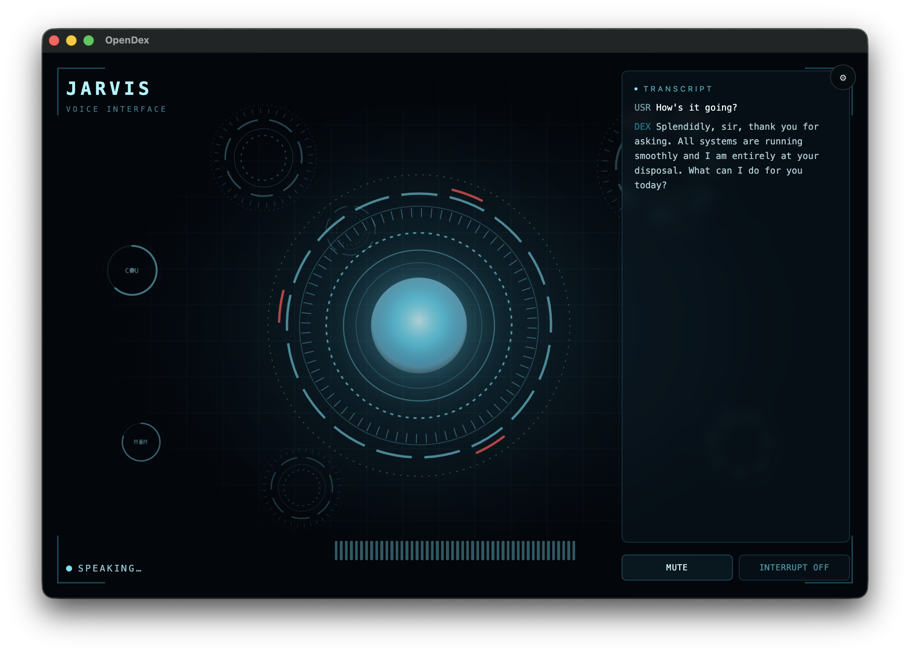
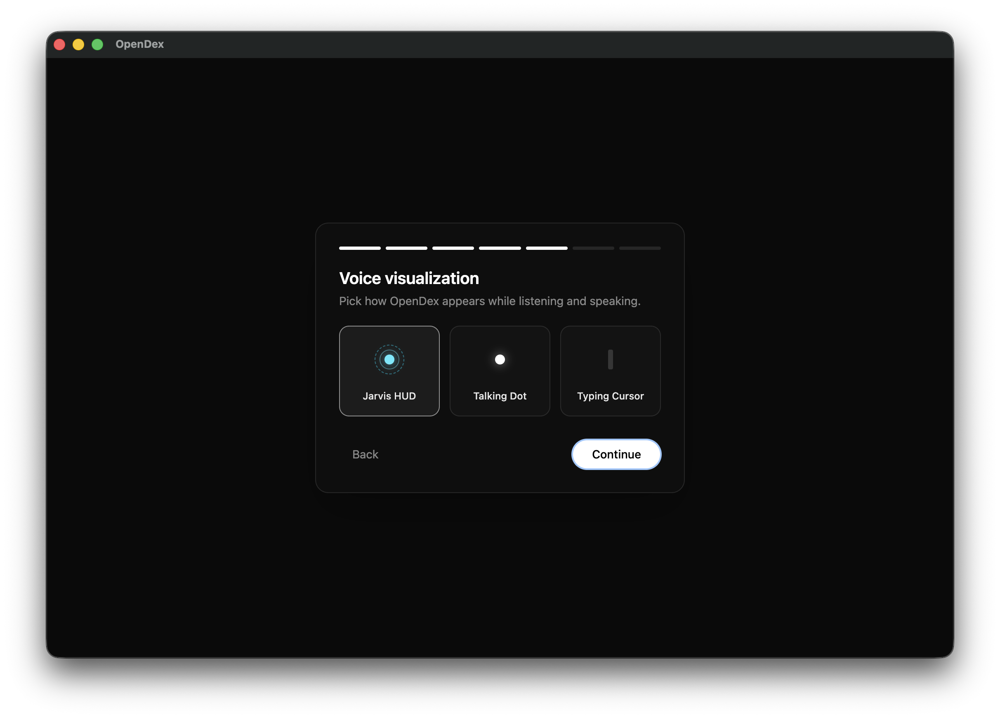
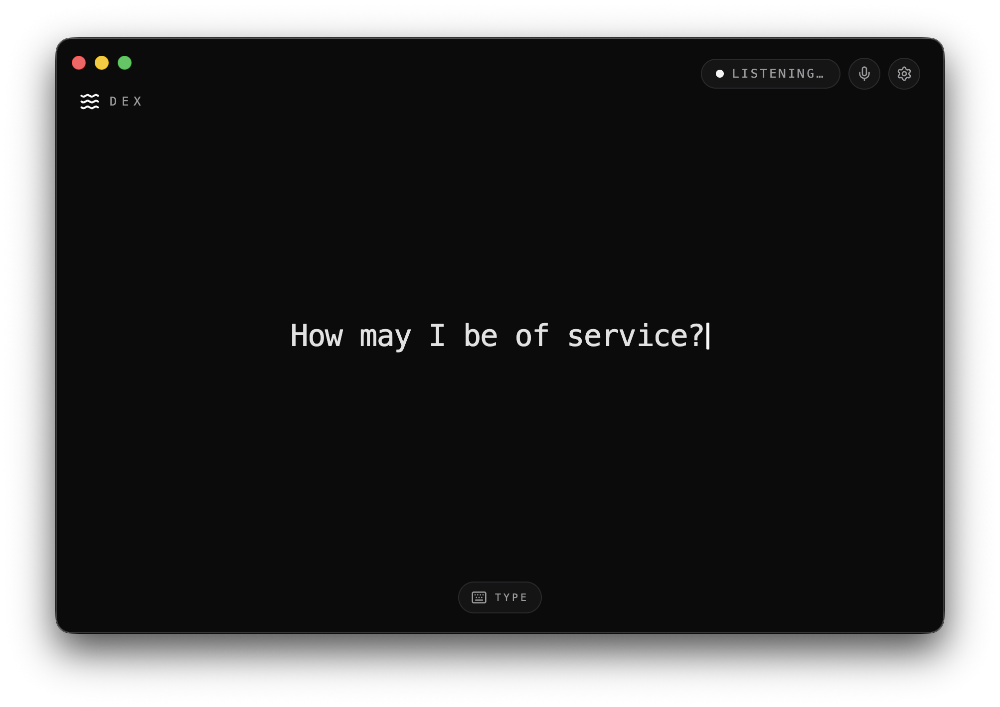

<div align="center">

# OpenDex

**A voice-first, open-source AI assistant for your desktop.**
Wake it, talk to it, and a tool-using agent talks back — in a cinematic interface you choose.

[](LICENSE)
[](#install)
[](https://www.electronjs.org/)
[](https://sdk.vercel.ai/)
[](https://github.com/wassgha/notjarvis/stargazers)



</div>

## Download

<div align="center">

<a href="https://github.com/wassgha/opendex/releases/latest/download/OpenDex-mac-arm64.dmg"></a>
&nbsp;
<a href="https://github.com/wassgha/opendex/releases/latest/download/OpenDex-mac-x64.dmg"></a>

<a href="https://github.com/wassgha/opendex/releases/latest/download/OpenDex-Setup.exe"></a>

<a href="https://github.com/wassgha/opendex/releases/latest/download/OpenDex-linux.deb"></a>

<a href="https://github.com/wassgha/opendex/releases/latest/download/OpenDex-linux.AppImage"></a>

<br>

[](https://github.com/wassgha/opendex/releases/latest)

</div>

Or browse every version on the [Releases](https://github.com/wassgha/opendex/releases) page.

The app **auto-updates**: it checks GitHub Releases on launch (and hourly), downloads new versions in the background, and prompts you to restart when one is ready.

## What is OpenDex?

OpenDex is a desktop app that turns any LLM into a hands-free, **Iron-Man-style voice assistant**. Say the wake word (or push to talk), speak naturally, and the agent thinks, uses tools, and replies out loud — streaming its answer into a live visualization.

It's a **harness**, not a single bot: the model, the voice, the wake/transcription engines, the on-screen theme, the greeting, and the agent's skills are all configurable, and it can run **fully offline and free** (local speech in, local speech recognition, system voice out) — you only need a model key.

## Features

- 🎙️ **Voice-first loop** — wake word → listen → think (with tools) → speak, plus natural follow-ups and opt-in barge-in (interrupt mid-reply).
- 🧠 **Any model** — routes through the Vercel AI Gateway, so one key gets you Claude, GPT, Gemini, and more (`anthropic/claude-sonnet-4-6` by default).
- 🆓 **Free & offline option** — Vosk wake word + local Whisper transcription (WASM, no signup) and your OS's built-in voice. No data leaves the machine except the LLM call.
- 🔌 **Pluggable voice I/O** — wake via push-to-talk, Vosk, Porcupine, or Web Speech; transcribe via local Whisper/Vosk, OpenAI, or Web Speech; speak via ElevenLabs or system TTS.
- 🎨 **Full-interface themes** — the theme *is* the whole UI: a cinematic **Jarvis HUD** with an animated arc reactor, a minimal **Talking Dot**, or a **Typing Cursor** terminal. All react to your voice.
- 🛠️ **Agentic skills with a permission gate** — the agent can take real actions (e.g. open apps & URLs); sensitive actions pop an **Allow once / Always / Deny** prompt that's remembered per skill.
- 🖥️ **Computer-use (opt-in)** — let it *see the screen and drive the mouse & keyboard* to operate apps for you. Works with any vision model (screenshots stream back as images), and stays behind the permission gate.
- 🔐 **Secure by design** — API keys are encrypted with your OS keychain and live only in the main process, never in the UI.

## Screenshots

| First-run setup | Minimal "typing cursor" theme |
| --- | --- |
|  |  |

## Build from source

> Requires [Node.js](https://nodejs.org) 20+ and [pnpm](https://pnpm.io).

```bash
git clone https://github.com/wassgha/opendex.git
cd opendex
pnpm install
pnpm dev            # launches the OpenDex desktop window
```

On first launch a short **onboarding wizard** walks you through the model key, voice, wake/transcription engine, theme, and greeting. Everything is changeable later from the **Settings** gear (⚙).

The only thing you must provide is an LLM key (an **AI Gateway key**, or any provider key it proxies). Everything else can be free/offline:

- **Voice out:** "System voice" (free) or ElevenLabs (key).
- **Voice in:** local **Whisper**/**Vosk** (free, offline, one-time model download) or OpenAI Whisper (key).
- **Wake:** push-to-talk / Vosk (free) or Porcupine (free Picovoice key).

### Optional `.env` (dev convenience)

Keys are normally entered in-app and stored encrypted. For development you can seed them via `.env` (used only as a fallback):

```bash
cp .env.local.example .env
```

| Variable | Purpose |
| --- | --- |
| `AI_GATEWAY_API_KEY` | required — lets the agent think/reply |
| `ELEVENLABS_API_KEY` | ElevenLabs TTS (skip if using the system voice) |
| `OPENAI_API_KEY` | OpenAI Whisper transcription (optional) |
| `PICOVOICE_ACCESS_KEY` | Porcupine wake word (optional, free) |
| `TAVILY_API_KEY` | web-search tool (optional) |

## Skills & permissions

The agent's capabilities are **skills** — declarative tool bundles. Sensitive ones run behind a permission gate: when the model wants to act, OpenDex pauses and asks, and your choice (Allow once / Always / Never) is remembered. Built-in skills today: **Open apps & URLs**, and **Control the computer** (screen capture + mouse/keyboard — opt-in, off by default).

> **Computer-use setup (macOS):** enable *Control the computer* in **Settings → Skills & tools**, then grant OpenDex **Screen Recording** and **Accessibility** permission in *System Settings → Privacy & Security* (without them, screenshots come back blank and clicks do nothing). It's powerful — keep the permission on **Ask**, and "Allow once" covers the whole task it's working on.

## Roadmap

- [x] Electron shell + secure agent/TTS-over-IPC
- [x] Config, onboarding & OS-keychain key storage
- [x] Full-interface themes (Jarvis HUD · Talking Dot · Typing Cursor)
- [x] Pluggable wake-word + speech-to-text (incl. free offline Whisper & Vosk)
- [x] Skills + permission gate *(Open apps & URLs)*
- [x] Computer-use — screen capture + mouse/keyboard control, gated & opt-in
- [ ] MCP servers + more built-in skills (shell, filesystem, …)
- [ ] Signed GitHub releases + auto-update

## Scripts

| Command | Description |
| --- | --- |
| `pnpm dev` | run the app with hot reload |
| `pnpm build` | build main/preload/renderer into `out/` |
| `pnpm start` | run the built app |
| `pnpm dist` | package installers (mac/win/linux) via electron-builder |
| `pnpm typecheck` | `tsc --noEmit` |
| `pnpm smoke:chat [briefing]` | exercise the agent loop without Electron |

## Tech Stack

Electron · electron-vite · React 19 · Tailwind CSS 4 · Vercel AI SDK v6 · ElevenLabs · Picovoice Porcupine · Vosk · transformers.js (Whisper) — all local speech engines are WASM. The only native module is **nut.js** (computer-use input control); it ships prebuilt N-API binaries per platform.

## License

[MIT](LICENSE) — contributions welcome.
